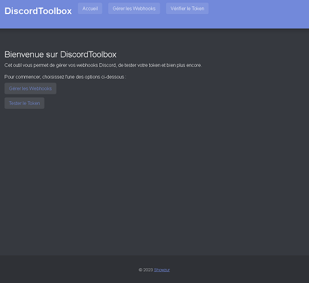
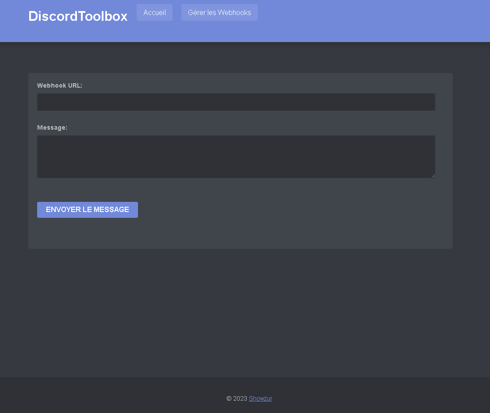

<h1 align="center">DiscordToolbox</h1>

  

> A HTML/CSS/JS development that allows you to manage the webhooks of your Discord server, and much more!

<<<<<<< HEAD

=======

>>>>>>> 5266f5d6d3c478986d11fc67eae8eeee8db2bd8d

## 🚀 Usage

To use this project, you can simply open the index.html file in your preferred web browser. You'll then be able to explore the various functionalities of the project in an intuitive way thanks to the user-friendly interface. No particular technical knowledge is required to use this project.

## 👤 Author

**Showzur**

* SRV Discord: [Shynonime](https://discord.gg/UHy8mZsNh8)
* Twitter: [@Showzur](https://twitter.com/Showzur)
* Github: [@shwzr](https://github.com/shwzr)

## Show your support

Give a ⭐️ if this project helped you!

## 📝 License

Copyright © 2023 [Showzur](https://github.com/shwzr). 

***
